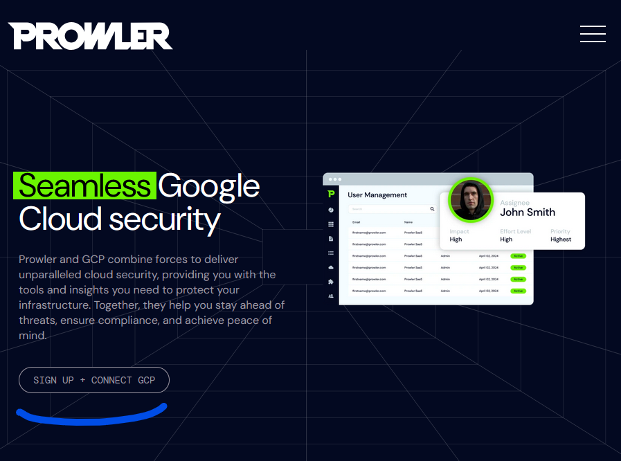
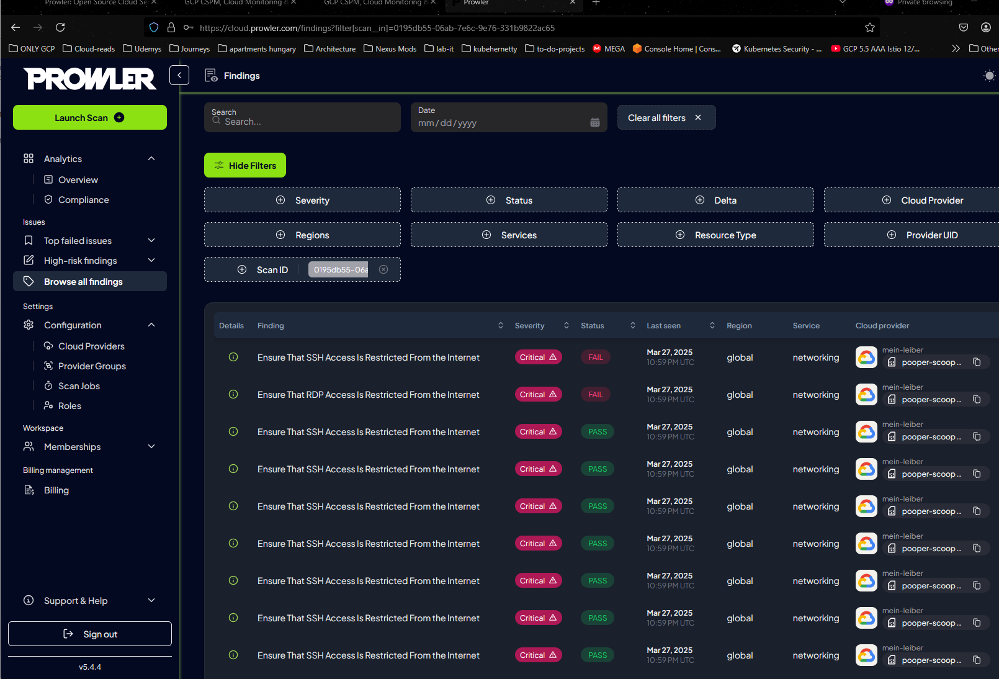

# Utilizing Prowler to Asses Organization wide Vulnerabilities and GKE Vulnerabilities

Prowler is an open-source, third-party security tool designed to assess the security posture of cloud environments across all major providers — GCP, AWS, and Azure. It offers multiple deployment options, including a web-based dashboard and a command-line interface (CLI), allowing flexibility based on your use case and workflow.

In this guide, we’ll focus on using both the **web application** and the Kubernetes version of Prowler to run comprehensive security audits.

The **web app** version can be configured to scan and report on all resources within a selected cloud environment, giving you a high-level overview of misconfigurations, compliance gaps, and best practice violations. The **Kubernetes version on the other hand, offers a more hands-on, customizable approach — perfect for integrating into pipelines or targeted checks.

Let’s walk through how to get both up and running.

In this guide We'll be setting up our environments scans via the web application across an entire GCP environment. 

And Deploying prowler as a batch job within a Kubernetes cluster.

Links:
- https://prowler.com/
- https://docs.prowler.com/projects/prowler-open-source/en/latest/#kubernetes
- https://docs.prowler.com/projects/prowler-open-source/en/latest/#prowler-cli-installation
- https://github.com/prowler-cloud
- https://docs.prowler.com/projects/prowler-open-source/en/latest/tutorials/prowler-app/#

*Do note the CLI version of the application is only compatible with Unix based Operating systems.*

---
## Using the Prowler Web application to Assess a GCP environment. 

We begin by creating API credentials so the prowler web application can make calls to our GPC project on our behalf.

Go to the google console home-page

1. Open your GCP Cloud console and type `oauth consent screen` into the search bar


2. After landing at the Oauth overview click the clients row from the lefthand column


3.  Click on create client. And select desktop app and give it a name and click create.


4. Important! copy and paste you client ID and secret into a notepad and click the ==Download JSON button==


5. Now Git Clone my Repository to your computer and CD into the `credentials` Folder

	- Copy and paste your JSON file into this directory and rename it to `secret.json` to match the below script

*This Script will make an API call to GCP using your information so we can obtain our last credential to authorize the prowler application to make API calls to our google cloud project.*
```python
from google_auth_oauthlib.flow import InstalledAppFlow

flow = InstalledAppFlow.from_client_secrets_file(
    'secret.json',
    scopes=['https://www.googleapis.com/auth/cloud-platform']
)

creds = flow.run_local_server(port=8080)

print("\nACCESS TOKEN:")
print(creds.token)

print("\nREFRESH TOKEN (SAVE THIS!):")
print(creds.refresh_token)
```

6. In your terminal execute the python application. A browser window should now open up on your screen.
*You should see an output like the following*
```shell
User@Caranthir MINGW64 /c/terraform/prowler-creds/credentials
$ python cred-script.py
Please visit this URL to authorize this application: https://accounts.google.com/o/oauth2/auth?response_type=code&client_id=...
```

7. Select the email account you've used for GCP. 
*For me it's the premiumforges address*

8. Click on advanced and go to tester
*Google is a little unsure about our python script lol*


9. Click continue


10. After completion go back to your terminal, and you'll receive your refresh token needed for Prowler to authenticate to your cloud account. Save the refresh token in your notepad.

11. Navigate to the GCP version of prowler https://prowler.com/gcp/ and click signup and connect GCP


12. Create an account and validate your email


13. Click add provider


14. Add cloud provider and select google


15. Enter your project ID


16. And fill out your saved credentials here


17. After Execution it Will confirm your credentials are valid and will complete a scan on your environment automatically. Click see Finding once complete to view the results of your first security scan.


And that's it for the web scanner config! I encourage you to explore the various discrepancies prowler finds.

---
## Running a Kubernetes Job using the prowler image to scan your cluster.

In the next iteration of our Prowler integration, we'll deploy a Kubernetes `Job` to temporarily run a Prowler container. This instance will scan the control plane node's exposed configuration files and manifests for potential security weaknesses in the current state of your active cluster.

*In this example I'll be using a free Kubernetes environment for testing at the following link*
https://killercoda.com/playgrounds/scenario

1. After logging into and configuring a cluster, git clone the prowler repository and cd into the prowler folder 
```shell
controlplane:~$ git clone https://github.com/prowler-cloud/prowler.git
Cloning into 'prowler'...
remote: Enumerating objects: 103401, done.
remote: Counting objects: 100% (460/460), done.
remote: Compressing objects: 100% (253/253), done.
remote: Total 103401 (delta 358), reused 209 (delta 207), pack-reused 102941 (from 2)
Receiving objects: 100% (103401/103401), 123.02 MiB | 14.10 MiB/s, done.
Resolving deltas: 100% (73607/73607), done.
controlplane:~$ ls
filesystem  prowler
controlplane:~$ cd prowler/
```

2. Apply the Kubernetes folder: 
*You might have to do it twice due to the namespace not existing in time*
```shell
controlplane:~/prowler$ kubectl apply -f kubernetes
clusterrole.rbac.authorization.k8s.io/prowler-read-cluster created
clusterrolebinding.rbac.authorization.k8s.io/prowler-read-cluster-binding created
namespace/prowler-ns created
serviceaccount/prowler-sa created
Error from server (NotFound): error when creating "kubernetes/job.yaml": namespaces "prowler-ns" not found
controlplane:~/prowler$ kubectl apply -f kubernetes
job.batch/prowler created
clusterrole.rbac.authorization.k8s.io/prowler-read-cluster unchanged
clusterrolebinding.rbac.authorization.k8s.io/prowler-read-cluster-binding unchanged
namespace/prowler-ns unchanged
serviceaccount/prowler-sa unchanged
```

3. Get the pods in the namespace and wait for a completed status
```shell
controlplane:~/prowler$ kubectl get pods -n prowler-ns
NAME            READY   STATUS      RESTARTS   AGE
prowler-95vwn   0/1     Completed   0          74s
```

4. And finally Read the Logs using `kubectl logs prowler-YOURPOD -n prowler-ns` to view the cluster scan results.
*Detailed results are stored in the mentioned path*
```shell
controlplane:~/prowler$ kubectl logs prowler-95vwn -n prowler-ns
                         _
 _ __  _ __ _____      _| | ___ _ __
| '_ \| '__/ _ \ \ /\ / / |/ _ \ '__|
| |_) | | | (_) \ V  V /| |  __/ |
| .__/|_|  \___/ \_/\_/ |_|\___|_|v5.4.2
|_| the handy multi-cloud security tool

Date: 2025-03-28 06:17:30

-> Using the Kubernetes credentials below:
  · Kubernetes Pod: prowler
  · Namespace: prowler-ns

-> Using the following configuration:
  · Config File: /home/prowler/.local/lib/python3.12/site-packages/prowler/config/config.yaml

Executing 83 checks, please wait...
-> Scan completed! |▉▉▉▉▉▉▉▉▉▉▉▉▉▉▉▉▉▉▉▉▉▉▉▉▉▉▉▉▉▉▉▉▉▉▉▉▉▉▉▉| 83/83 [100%] in 0.8s 

Overview Results:
╭────────────────────┬─────────────────────┬────────────────╮
│ 11.52% (65) Failed │ 85.11% (480) Passed │ 0.0% (0) Muted │
╰────────────────────┴─────────────────────┴────────────────╯

Context In-Cluster Scan Results (severity columns are for fails only):
╭────────────┬────────────────────┬───────────┬────────────┬────────┬──────────┬───────┬─────────╮
│ Provider   │ Service            │ Status    │   Critical │   High │   Medium │   Low │   Muted │
├────────────┼────────────────────┼───────────┼────────────┼────────┼──────────┼───────┼─────────┤
│ kubernetes │ apiserver          │ FAIL (15) │          0 │      5 │       10 │     0 │       0 │
├────────────┼────────────────────┼───────────┼────────────┼────────┼──────────┼───────┼─────────┤
│ kubernetes │ controller-manager │ FAIL (1)  │          0 │      0 │        1 │     0 │       0 │
├────────────┼────────────────────┼───────────┼────────────┼────────┼──────────┼───────┼─────────┤
│ kubernetes │ core               │ FAIL (26) │          0 │     26 │        0 │     0 │       0 │
├────────────┼────────────────────┼───────────┼────────────┼────────┼──────────┼───────┼─────────┤
│ kubernetes │ etcd               │ PASS (6)  │          0 │      0 │        0 │     0 │       0 │
├────────────┼────────────────────┼───────────┼────────────┼────────┼──────────┼───────┼─────────┤
│ kubernetes │ kubelet            │ FAIL (1)  │          0 │      1 │        0 │     0 │       0 │
├────────────┼────────────────────┼───────────┼────────────┼────────┼──────────┼───────┼─────────┤
│ kubernetes │ RBAC               │ FAIL (21) │          0 │     21 │        0 │     0 │       0 │
├────────────┼────────────────────┼───────────┼────────────┼────────┼──────────┼───────┼─────────┤
│ kubernetes │ scheduler          │ FAIL (1)  │          0 │      0 │        1 │     0 │       0 │
╰────────────┴────────────────────┴───────────┴────────────┴────────┴──────────┴───────┴─────────╯
* You only see here those services that contains resources.

Detailed results are in:
 - JSON-OCSF: /home/prowler/output/prowler-output-In-Cluster-20250328061730.ocsf.json
 - CSV: /home/prowler/output/prowler-output-In-Cluster-20250328061730.csv
 - HTML: /home/prowler/output/prowler-output-In-Cluster-20250328061730.html

Compliance Status of CIS_1.10_KUBERNETES Framework:
╭──────────────────┬───────────────────┬────────────────╮
│ 11.76% (64) FAIL │ 88.24% (480) PASS │ 0.0% (0) MUTED │
╰──────────────────┴───────────────────┴────────────────╯

Compliance Status of CIS_1.8_KUBERNETES Framework:
╭──────────────────┬───────────────────┬────────────────╮
│ 11.93% (65) FAIL │ 88.07% (480) PASS │ 0.0% (0) MUTED │
╰──────────────────┴───────────────────┴────────────────╯

Compliance Status of PCI_4.0_KUBERNETES Framework:
╭─────────────────┬──────────────────┬────────────────╮
│ 11.2% (42) FAIL │ 88.8% (333) PASS │ 0.0% (0) MUTED │
╰─────────────────┴──────────────────┴────────────────╯

Detailed compliance results are in /home/prowler/output/compliance/
```

And that is it for setting up a Kubernetes local scan using the prowler image as a job.  Hopefully you found this repo and documentation helpful in implementing this tool!


---
# Bonus Section - Using a shell script to force the detailed results in to the log's output. 

- This section shows my updated job yaml which is used to pull the raw stored files from the scan in a completely raw format.
*The Data will definently need to be parsed, but I did this to validate the results were valid and exist*

```shell
apiVersion: batch/v1
kind: Job
metadata:
  name: prowler
  namespace: prowler-ns
spec:
  template:
    metadata:
      labels:
        app: prowler
    spec:
      serviceAccountName: prowler-sa
      containers:
      - name: prowler
        image: toniblyx/prowler:stable
        command: ["/bin/sh", "-c"]
        args:
          - >
            prowler kubernetes -z &&
            echo "=== OUTPUT BELOW ===" &&
            cat /home/prowler/output/*.csv &&
            echo "=== END OF OUTPUT ==="
        imagePullPolicy: Always
        volumeMounts:
          - name: var-lib-cni
            mountPath: /var/lib/cni
            readOnly: true
          - mountPath: /var/lib/etcd
            name: var-lib-etcd
            readOnly: true
          - mountPath: /var/lib/kubelet
            name: var-lib-kubelet
            readOnly: true
          - mountPath: /var/lib/kube-scheduler
            name: var-lib-kube-scheduler
            readOnly: true
          - mountPath: /var/lib/kube-controller-manager
            name: var-lib-kube-controller-manager
            readOnly: true
          - mountPath: /etc/systemd
            name: etc-systemd
            readOnly: true
          - mountPath: /lib/systemd/
            name: lib-systemd
            readOnly: true
          - mountPath: /srv/kubernetes/
            name: srv-kubernetes
            readOnly: true
          - mountPath: /etc/kubernetes
            name: etc-kubernetes
            readOnly: true
          - mountPath: /usr/local/mount-from-host/bin
            name: usr-bin
            readOnly: true
          - mountPath: /etc/cni/net.d/
            name: etc-cni-netd
            readOnly: true
          - mountPath: /opt/cni/bin/
            name: opt-cni-bin
            readOnly: true
      hostPID: true
      restartPolicy: Never
      volumes:
        - name: var-lib-cni
          hostPath:
            path: /var/lib/cni
        - hostPath:
            path: /var/lib/etcd
          name: var-lib-etcd
        - hostPath:
            path: /var/lib/kubelet
          name: var-lib-kubelet
        - hostPath:
            path: /var/lib/kube-scheduler
          name: var-lib-kube-scheduler
        - hostPath:
            path: /var/lib/kube-controller-manager
          name: var-lib-kube-controller-manager
        - hostPath:
            path: /etc/systemd
          name: etc-systemd
        - hostPath:
            path: /lib/systemd
          name: lib-systemd
        - hostPath:
            path: /srv/kubernetes
          name: srv-kubernetes
        - hostPath:
            path: /etc/kubernetes
          name: etc-kubernetes
        - hostPath:
            path: /usr/bin
          name: usr-bin
        - hostPath:
            path: /etc/cni/net.d/
          name: etc-cni-netd
        - hostPath:
            path: /opt/cni/bin/
          name: opt-cni-bin
```

---